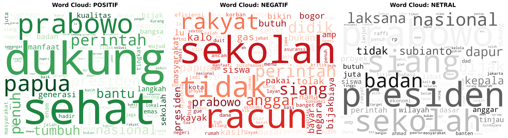
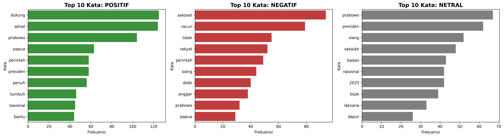

# Sentiment Analysis: Program Makan Bergizi Gratis (MBG) pada Media Sosial X

Repositori ini berisi proyek analisis sentimen terkait opini masyarakat Indonesia terhadap program **Makan Bergizi Gratis (MBG)**. Proyek ini menggunakan algoritma **Support Vector Machine (SVM)** dan menerapkan pendekatan **Data-Centric AI** untuk memastikan kualitas label pada dataset.

---

## 📌 Deskripsi Proyek

Program Makan Bergizi Gratis merupakan salah satu isu nasional yang memicu diskursus luas di platform X (Twitter). Proyek ini bertujuan untuk mengklasifikasikan opini publik ke dalam tiga kategori:

- Positif
- Negatif
- Netral

Fokus utama proyek ini tidak hanya pada akurasi model, tetapi juga pada kualitas data melalui validasi label.

---

## 📂 Sumber Dataset

**tasyapndya** (2025). _free_nutritious_meals_sentiment_x_id_2025_.  
📎 [Hugging Face Dataset](https://huggingface.co/datasets/tasyapndya/free_nutritious_meals_sentiment_x_id_2025)

Dataset ini berisi opini masyarakat Indonesia di platform X terkait program Makan Bergizi Gratis yang telah dilabeli ke dalam tiga kategori sentimen: positif, negatif, dan netral.

---

## 🛠️ Tech Stack

- **Bahasa**: Python
- **Machine Learning**: Scikit-learn (SVM)
- **Data Validation**: Cleanlab (Confident Learning)
- **NLP**:
  - Sastrawi (Stemming & Stopwords)
  - NLTK (Tokenization)
- **Visualisasi**: Matplotlib, Seaborn, WordCloud

---

## 🧪 Metodologi & Alur Kerja

### 1. Preprocessing (Data Cleaning)

Tahapan praproses dilakukan untuk menangani karakteristik teks media sosial yang tidak terstruktur:

- **Normalisasi Slang**  
  Mengubah kata tidak baku menjadi formal menggunakan kamus alay.

- **Handling Negasi**  
  Kata negasi seperti _"tidak"_, _"jangan"_, dan _"kurang"_ dipertahankan karena berperan penting dalam menentukan polaritas sentimen pada model unigram.

- **Normalisasi Hashtag**  
  Memecah tagar gabungan menjadi kata-kata terpisah.

---

### 2. Penanganan Mislabel (Cleanlab)

Proyek ini menggunakan metode **Confident Learning** melalui library Cleanlab untuk mendeteksi anomali pada label data.

- **Temuan**:  
  Ditemukan sekitar **258 data (±23%)** yang terindikasi mislabel atau ambigu.

- **Solusi**:  
  Dilakukan koreksi label sebelum pelatihan model untuk meningkatkan konsistensi pembelajaran SVM.

---

### 3. Ekstraksi Fitur

- **Metode**: TF-IDF (Term Frequency–Inverse Document Frequency)
- **Konfigurasi**: Unigram (1,1)

Dipilih untuk menjaga dimensi fitur tetap sederhana dan stabil, mengingat ukuran dataset yang relatif terbatas (±1103 data).

---

### 4. Pemodelan SVM

- **Kernel**: Linear  
  (Efektif untuk data teks berbasis TF-IDF)

- **Class Weight**: balanced  
  (Untuk menangani ketidakseimbangan kelas)

---

## 📊 Hasil dan Performa

Model SVM menghasilkan performa sebagai berikut:

| Metric         | Score |
| -------------- | ----- |
| Accuracy       | 0.81  |
| Macro F1-Score | 0.80  |

---

### 🔍 Analisis Temuan

- **Kelas Positif**  
  Didominasi oleh kata seperti _dukung_, _sehat_, dan _manfaat_.

- **Kelas Negatif**  
  Banyak membahas isu seperti _keamanan pangan_ dan _pengelolaan anggaran_.

- **Kelas Netral**  
  Cenderung berupa informasi atau berita tanpa emosi yang kuat.

---

## 📈 Visualisasi Utama

### Wordcloud

### Bar Chart

Visualisasi di atas menunjukkan:

- **Sentimen Positif** didominasi oleh kata seperti _dukung_, _sehat_, dan _bantu_, yang mencerminkan dukungan terhadap program.
- **Sentimen Negatif** banyak mengandung kata seperti _racun_, _tolak_, dan _anggaran_, yang menunjukkan kekhawatiran atau kritik masyarakat.
- **Sentimen Netral** cenderung berisi kata informatif seperti _presiden_, _sekolah_, dan _program_.

Sebagai catatan, kata-kata umum terkait topik seperti _makan_, _bergizi_, dan _gratis_ tidak ditampilkan dalam visualisasi untuk menghindari bias frekuensi.

---

### 2. Analisis Fitur Model

- **SVM Coefficients (Feature Importance)**

Menampilkan kata-kata yang paling berpengaruh dalam keputusan model untuk masing-masing kelas.

---

## 🚀 Kesimpulan

Model SVM dengan pendekatan Data-Centric AI mampu memberikan performa yang stabil dalam mengklasifikasikan sentimen publik terhadap program MBG. Peningkatan kualitas data, terutama melalui penanganan mislabel, memberikan kontribusi signifikan terhadap hasil akhir model.
